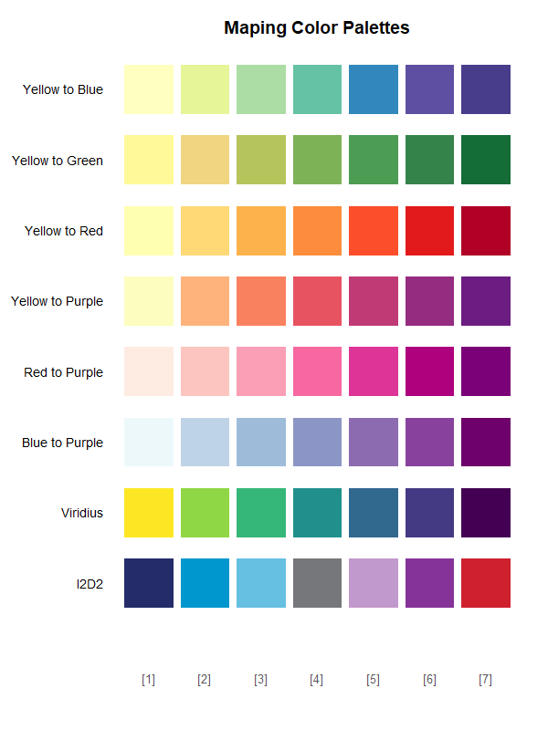

# MYOM
MYOM (Make Your Own Map) is a web app driven by Shiny that allows users to make their own Iowa map using their own county-level data. 

### Make Your First Map
- import data by uploading a `.csv` file
- when upload is completed select two columns (names of the column will be populated automatically) - one with the county names or fips codes and other with variable to be plotted
- after selecting both variables make the map by pressing **Plot Map** button
- adjust some features of the map or data as needed (see description below)
- download the figure by clicking **Download Map** button 

### Split Data
Explain how **Split Data into Bins** works

### Edit Map
The app allows users to slightly modify the appearance of the map via a set of handles on the right side of the plotting area. 

#### Plot Title
Some text

#### Legend
Some text

#### County Labels
Some text

#### Colors
Some text

#### Fonts
List of fonts available for selection:
* Arial
* Courier
* Times New Roman
