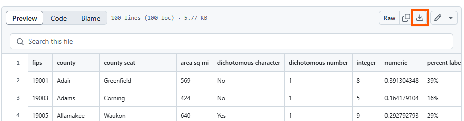

# Sample Data

An <a href="https://github.com/I2D2-Data-Team/MYOM/blob/main/data/sample_data.csv" target="_blank">example input file</a> with dummy data is available for download as a CSV file on our <a href="https://github.com/I2D2-Data-Team/MYOM" target="_blank">GitHub repository</a>. The file is comprised of 10 columns including county name (`county`) and country FIPS code (`fips`) together with variables of different data types (string, integer, double, dichotomous character/numeric).

## To Use Sample Data

-   Download the file by clicking on **Download raw file** button (shown in orange square in the figure below)

   

-   Save file in local machine

-   Replace data with your own

-   Upload the file to the web application (see **About** for details)

> **TIP:** when replacing data make sure that values in each column are of the same type (string, numeric, etc.) and formatted uniformly (e.g. percent labels are following the same format `XX%`).
